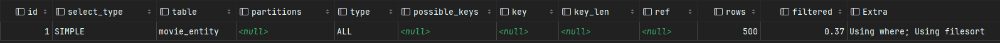
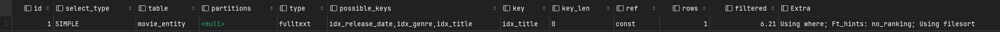

# 목차
* [전제 조건](#전제-조건)
* [Index 성능 테스트](#Index-성능-테스트)
* [Cache 성능 테스트](#caching-성능-테스트)
  * [캐시 적용 전](#캐시-적용-전)
  * [로컬 캐시](#로컬-캐시-적용)
  * [글로벌 캐시](#글로벌-캐시-적용)
* [추후 개선 방향](#추후-redisson-도입으로-인한-기대-효과)

# 전제 조건

- **DAU**: 500명
- **1명당 1일 평균 접속 수**: 2번
- **피크 시간대의 집중률**: 평소 트래픽의 10배
- **Throughput 계산**:
    - **1일 총 접속 수** = DAU × 1명당 1일 평균 접속 수 = N × 2 = **2N** (1일 총 접속 수)
    - **1일 평균 RPS** = 1일 총 접속 수 ÷ 86,400 (초/일)= 2N ÷ 86,400 ≈ **X** **RPS**
    - **1일 최대 RPS** = 1일 평균 RPS × (최대 트래픽 / 평소 트래픽)= X × 10 = **10X RPS**
- VU: N명
- optional
    - thresholds
        - e.g p(95) 의 응답 소요 시간 200ms 이하
        - 실패율 1% 이하

## Index 성능 테스트

### 배경
- 상영 중인 영화 목록을 조회하기 위해 현재 날짜를 기준으로 개봉일이 지난 데이터를 반환한다.
- 요구사항으로 제목, 장르를 통한 검색 기능이 추가되었다.
- 인덱스를 적용할 컬럼을 선택하고 적용 전후를 비교하는 성능 테스트 진행.

### 적용 전

**1. 실행 쿼리**
```sql
select
    *
from
    movie_entity
where
    title like '%영화제목%'
    and genre = '장르'
    and releaseDate <= '현재날짜'
order by
    release_date
```

**2. 실행 계획 (explain & analyze)**



```sql
-> Sort: movie_entity.release_date  (cost=51 rows=500) (actual time=0.336..0.336 rows=1 loops=1)
 -> Filter: ((movie_entity.genre = 'Comedy') and (movie_entity.title like '%123%') and (movie_entity.release_date <= DATE'2025-03-01'))  
    (cost=51 rows=500) (actual time=0.089..0.327 rows=1 loops=1)
  -> Table scan on movie_entity  (cost=51 rows=500) (actual time=0.0278..0.284 rows=500 loops=1)
```

**3. 부하 테스트 결과**
```
     ✓ status is 200
     ✗ response time < 200ms
      ↳  96% — ✓ 59 / ✗ 2

     checks.........................: 98.36% 120 out of 122
     data_received..................: 7.7 kB 126 B/s
     data_sent......................: 6.9 kB 113 B/s
     http_req_blocked...............: avg=4.7ms    min=2.23ms   med=3.56ms   max=38.36ms  p(90)=5.77ms   p(95)=7.07ms
     http_req_connecting............: avg=4.48ms   min=2.11ms   med=3.36ms   max=38.08ms  p(90)=5.56ms   p(95)=6.65ms
   ✓ http_req_duration..............: avg=76.84ms  min=18.59ms  med=27.98ms  max=2.01s    p(90)=35.91ms  p(95)=39.52ms
       { expected_response:true }...: avg=76.84ms  min=18.59ms  med=27.98ms  max=2.01s    p(90)=35.91ms  p(95)=39.52ms
   ✓ http_req_failed................: 0.00%  0 out of 61
     http_req_receiving.............: avg=701.45µs min=104.87µs med=495.78µs max=2.91ms   p(90)=1.44ms   p(95)=1.59ms
     http_req_sending...............: avg=159.6µs  min=59.1µs   med=132.35µs max=558.17µs p(90)=254.49µs p(95)=353.23µs
     http_req_tls_handshaking.......: avg=0s       min=0s       med=0s       max=0s       p(90)=0s       p(95)=0s
     http_req_waiting...............: avg=75.98ms  min=18.39ms  med=27.48ms  max=2.01s    p(90)=34.99ms  p(95)=39.31ms
     http_reqs......................: 61     0.999433/s
     iteration_duration.............: avg=1.08s    min=1.02s    med=1.03s    max=3.02s    p(90)=1.04s    p(95)=1.04s
     iterations.....................: 61     0.999433/s
     vus............................: 1      min=1          max=3
     vus_max........................: 500    min=500        max=500
```

### 적용 후

**인덱스 선택**
- title(영화제목) :
  - `LIKE '%영화 제목%'` 형태의 검색은 일반 인덱스를 타지 않아 풀 테이블 스캔 발생.
  - 중간 검색 성능을 높이기 위해 **FullText Index 설정**
- genre(장르) : 
  - 카디널리티가 상대적으로 높아 데이터 분포가 고르게 퍼져 있어 특정 값 검색 시 인덱스 활용도가 높을 것으로 예상.
  - 특정 장르에 대한 검색이 자주 수행되는 경우, 인덱스를 활용했을 때 불필요한 데이터 스캔을 줄일 수 있음.
- releaseDate(개봉일) :
  - 현재 날짜를 기준으로 범위 검색이 자주 발생하는 컬럼
  - 개봉일이 중복되는 데이터가 적어, 인덱스 성능이 유지될 가능성 있음.
  - 개봉일 순서로 정렬되기 때문에 인덱스를 활용했을 때 빠르게 필터링 후 정렬 가능

**1. 실행 쿼리**
```sql
select 
    * 
from 
    movie_entity 
where 
    match(title) against('영화제목')
    and genre = '장르'
    and releaseDate <= '현재날짜'
order by
	release_date
```

**2. 적용한 인덱스 DDL**
```sql
create index idx_release_date on movie_entity (release_date);
create index idx_genre on movie_entity(genre);
CREATE FULLTEXT INDEX idx_title ON movie_entity(title);
```

**3. 실행 계획 (explain & analyze)**


```sql
-> Sort row IDs: movie_entity.release_date  (cost=0.256 rows=1) (actual time=0.0366..0.0367 rows=1 loops=1)
  -> Filter: ((movie_entity.genre = 'Comedy') and (match movie_entity.title against ('123')) and (movie_entity.release_date <= DATE'2025-03-01'))  
    (cost=0.256 rows=1) (actual time=0.0221..0.0226 rows=1 loops=1)
    -> Full-text index search on movie_entity using idx_title (title='123')  (cost=0.256 rows=1) (actual time=0.0189..0.0193 rows=1 loops=1)
```

**4. 부하 테스트 결과**
```
✓ status is 200
✓ response time < 200ms

     checks.........................: 100.00% 122 out of 122
     data_received..................: 244 kB  4.0 kB/s
     data_sent......................: 6.9 kB  113 B/s
     http_req_blocked...............: avg=5.8ms    min=1.02ms   med=3.8ms    max=50.06ms  p(90)=8.67ms   p(95)=11.31ms 
     http_req_connecting............: avg=5ms      min=899.73µs med=3.62ms   max=49.78ms  p(90)=7.59ms   p(95)=10.75ms 
   ✓ http_req_duration..............: avg=28.74ms  min=18.51ms  med=27.45ms  max=48.45ms  p(90)=35.93ms  p(95)=41.5ms  
       { expected_response:true }...: avg=28.74ms  min=18.51ms  med=27.45ms  max=48.45ms  p(90)=35.93ms  p(95)=41.5ms  
   ✓ http_req_failed................: 0.00%   0 out of 61
     http_req_receiving.............: avg=478.91µs min=91.19µs  med=356.5µs  max=1.62ms   p(90)=1.05ms   p(95)=1.26ms  
     http_req_sending...............: avg=201.44µs min=54µs     med=162.49µs max=851.24µs p(90)=313.43µs p(95)=395.03µs
     http_req_tls_handshaking.......: avg=0s       min=0s       med=0s       max=0s       p(90)=0s       p(95)=0s      
     http_req_waiting...............: avg=28.06ms  min=17.94ms  med=26.56ms  max=47.46ms  p(90)=34.84ms  p(95)=41.06ms 
     http_reqs......................: 61      0.999475/s
     iteration_duration.............: avg=1.03s    min=1.02s    med=1.03s    max=1.08s    p(90)=1.04s    p(95)=1.04s   
     iterations.....................: 61      0.999475/s
     vus............................: 1       min=1          max=1
     vus_max........................: 500     min=500        max=500
```

## Caching 성능 테스트

**배경**
- 위에서 검색 기능에 대해 인덱스 테스트를 진행했다.
- 캐싱할 데이터는 검색 기능을 통해 조회되는 데이터가 아닌, **상영 중인 영화 목록 전체 데이터를 선택했다.**

**선정 이유**
- 사용자 입력 값에 따라 조회되는 데이터가 다르며, 해당 데이터들이 캐시에 모두 저장되는 것은 효율적이지 못하다 판단.
- 상영 중인 영화 목록 데이터의 경우, 가장 많이 조회되는 메인페이지에 반환되는 데이터로서, 데이터의 큰 변경없이 최대 하루까지는 동일한 데이터를 반환하기 때문에 캐시 데이터로 관리하기 용이할 것으로 예상되어 선택.

**적용 캐시**
- 로컬 캐시 :
  - `EhCache` : 다양한 기능을 제공하기 위해 생성되는 객체가 많아 메모리를 많이 사용하게 됨. -> GC 영향을 크게 받음
  - `Caffeine` : 메모리 내에서만 동작하며, EhCache 보다 상대적으로 GC의 부담이 적다.
  - 로컬 캐시를 사용한다면 빠르고 단순해야 한다고 판단되어 **Caffeine 캐시 적용** 
- 글로벌 캐시 : 
  - **현재 RedisCacheManager 를 사용**하여 글로벌 캐시 구현.
    - 코드 변경이 거의 없이 간단한 설정만으로 Redis 캐싱 적용 가능하기 때문에 선택.
    - 간편하지만 기능 제한이 있고, 매번 Redis를 조회하기 때문에 로컬 캐시를 활용하지 못함.

### 캐시 적용 전

- api 단일 호출 시 `평균 380ms` 응답 속도.

**부하 테스트 결과**
```
     ✓ status is 200
     ✗ response time < 200ms
      ↳  0% — ✓ 0 / ✗ 61

     checks.........................: 50.00% 61 out of 122
     data_received..................: 119 MB 1.9 MB/s
     data_sent......................: 6.2 kB 100 B/s
     http_req_blocked...............: avg=4.8ms    min=2.41ms   med=4.14ms   max=33.56ms  p(90)=6.42ms   p(95)=7.7ms
     http_req_connecting............: avg=4.56ms   min=2.25ms   med=3.92ms   max=33.42ms  p(90)=6.04ms   p(95)=7.12ms
   ✗ http_req_duration..............: avg=566.52ms min=259.2ms  med=585.57ms max=758.97ms p(90)=673.66ms p(95)=699.25ms
       { expected_response:true }...: avg=566.52ms min=259.2ms  med=585.57ms max=758.97ms p(90)=673.66ms p(95)=699.25ms
   ✓ http_req_failed................: 0.00%  0 out of 61
     http_req_receiving.............: avg=76.13ms  min=55.72ms  med=75.77ms  max=111.01ms p(90)=89.9ms   p(95)=94.07ms
     http_req_sending...............: avg=145.93µs min=63.54µs  med=124.67µs max=394.48µs p(90)=235.21µs p(95)=266.47µs
     http_req_tls_handshaking.......: avg=0s       min=0s       med=0s       max=0s       p(90)=0s       p(95)=0s
     http_req_waiting...............: avg=490.24ms min=179.18ms med=507.48ms max=668.74ms p(90)=574.4ms  p(95)=618.82ms
     http_reqs......................: 61     0.990756/s
     iteration_duration.............: avg=1.57s    min=1.26s    med=1.59s    max=1.76s    p(90)=1.67s    p(95)=1.7s
     iterations.....................: 61     0.990756/s
     vus............................: 1      min=1         max=1
     vus_max........................: 500    min=500       max=500
```

### 로컬 캐시 적용

- api 단일 호출 시 평`균 30 ms` 응답 속도
  - **평균 380ms -> 30ms 성능 향상**

**부하 테스트 결과**
```
     ✓ status is 200
     ✗ response time < 200ms
      ↳  96% — ✓ 59 / ✗ 2

     checks.........................: 98.36% 120 out of 122
     data_received..................: 119 MB 1.9 MB/s
     data_sent......................: 6.2 kB 101 B/s
     http_req_blocked...............: avg=4.67ms   min=2ms     med=3.27ms   max=38.85ms  p(90)=4.78ms   p(95)=11.9ms
     http_req_connecting............: avg=4.46ms   min=1.77ms  med=3.11ms   max=38.59ms  p(90)=4.48ms   p(95)=11.78ms
   ✓ http_req_duration..............: avg=130.52ms min=71.94ms med=92.56ms  max=1.72s    p(90)=111.88ms p(95)=128.11ms
       { expected_response:true }...: avg=130.52ms min=71.94ms med=92.56ms  max=1.72s    p(90)=111.88ms p(95)=128.11ms
   ✓ http_req_failed................: 0.00%  0 out of 61
     http_req_receiving.............: avg=86.94ms  min=63.17ms med=84.6ms   max=139.14ms p(90)=106.1ms  p(95)=117.9ms
     http_req_sending...............: avg=153.45µs min=64.11µs med=137.69µs max=868.38µs p(90)=228.69µs p(95)=261.08µs
     http_req_tls_handshaking.......: avg=0s       min=0s      med=0s       max=0s       p(90)=0s       p(95)=0s
     http_req_waiting...............: avg=43.42ms  min=3.99ms  med=7.53ms   max=1.58s    p(90)=12.18ms  p(95)=14.78ms
     http_reqs......................: 61     0.998356/s
     iteration_duration.............: avg=1.13s    min=1.07s   med=1.09s    max=2.73s    p(90)=1.11s    p(95)=1.14s
     iterations.....................: 61     0.998356/s
     vus............................: 1      min=1          max=2
     vus_max........................: 500    min=500        max=500
```

### 글로벌 캐시 적용
- api 단일 호출 시 `평균 380ms` 응답 속도.
  - 캐시 적용 전과 거의 동일한 성능.

**부하 테스트 결과**
```
     ✓ status is 200
     ✗ response time < 200ms
      ↳  0% — ✓ 0 / ✗ 61

     checks.........................: 50.00% 61 out of 122
     data_received..................: 119 MB 1.9 MB/s
     data_sent......................: 6.2 kB 101 B/s
     http_req_blocked...............: avg=4.65ms   min=2.18ms   med=3.38ms   max=52.59ms  p(90)=5.26ms   p(95)=8ms
     http_req_connecting............: avg=4.38ms   min=1.97ms   med=3.21ms   max=52.41ms  p(90)=4.31ms   p(95)=7.22ms
   ✗ http_req_duration..............: avg=385.92ms min=258.91ms med=307.22ms max=2.78s    p(90)=387.87ms p(95)=517.79ms
       { expected_response:true }...: avg=385.92ms min=258.91ms med=307.22ms max=2.78s    p(90)=387.87ms p(95)=517.79ms
   ✓ http_req_failed................: 0.00%  0 out of 61
     http_req_receiving.............: avg=85.06ms  min=62.33ms  med=79.09ms  max=166.25ms p(90)=102.68ms p(95)=130.99ms
     http_req_sending...............: avg=133.75µs min=63.96µs  med=128.5µs  max=298.16µs p(90)=182.68µs p(95)=213.79µs
     http_req_tls_handshaking.......: avg=0s       min=0s       med=0s       max=0s       p(90)=0s       p(95)=0s
     http_req_waiting...............: avg=300.72ms min=186.97ms med=217.62ms max=2.62s    p(90)=308.7ms  p(95)=444.09ms
     http_reqs......................: 61     0.994743/s
     iteration_duration.............: avg=1.39s    min=1.26s    med=1.31s    max=3.8s     p(90)=1.39s    p(95)=1.52s
     iterations.....................: 61     0.994743/s
     vus............................: 1      min=1         max=3
     vus_max........................: 500    min=500       max=500
```

**글로벌 캐시를 적용했음에도 적용 전과 동일한 성능이 나오는 이유**
- **충분하지 않은 테스트 데이터**
  - 캐시의 성능 차이를 확인하려면 반복적인 데이터 조회가 많아야 함 
  - 현재 테스트 데이터가 적어 캐시 적중률(Cache Hit Rate)이 낮을 가능성이 있음 
  - 결과적으로 캐시의 효과를 체감하기 어려움
- **네트워크 통신 오버헤드**
  - Redis는 외부 인프라로 동작하며, 네트워크를 통해 요청/응답해야 함 
  - 캐시를 적용했지만 네트워크 지연(latency)이 발생하면서 성능이 개선되지 않을 가능성이 있음 
  - 특히 단일 서버의 로컬 메모리 접근 속도(나노초 단위)와 비교하면, Redis를 통한 네트워크 통신 속도(마이크로초~밀리초 단위)가 상대적으로 느림

## **추후 Redisson 도입으로 인한 기대 효과**
- 로컬 캐시 + Redis 캐시를 함께 사용하여 조회 속도 향상
- Pub/Sub 기반으로 여러 서버 간 캐시 데이터 자동 동기화
- TTL, Max Size, 캐시 정책 등을 세밀하게 설정 가능
- 향후 Rate Limiting, 분산 락 등의 추가 기능 확장 가능